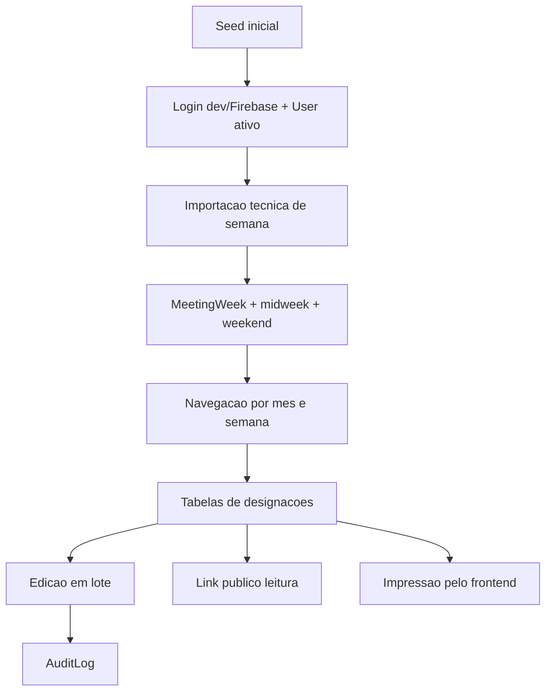

# Indice de Implementacao

Relacionado: [[00 - Indice]], [[08 - Plano de Implementacao]], [[03 - Arquitetura Tecnica]], [[05 - API e Contratos]], [[06 - Frontend e UX]]

Este conjunto de notas documenta a primeira implementacao do Varjotapp. Diferente da pasta [[00 - Indice|Planejamento]], estes documentos descrevem o que foi criado no codigo e como as funcionalidades se conectam.

## Visao geral

- [[01 - Fundacao do Monorepo]]
- [[02 - Banco de Dados e Seed]]
- [[03 - Autenticacao e Permissoes]]
- [[04 - Importacao de Semanas]]
- [[05 - Navegacao e Tabelas de Designacoes]]
- [[06 - Edicao em Lote e Historico]]
- [[07 - Participantes]]
- [[08 - Usuarios e Settings]]
- [[09 - BI Simples]]
- [[10 - Pagina Publica e Impressao]]
- [[11 - Setup Local e Validacao]]

## Fluxo principal implementado

## Principais relacoes

- O modelo implementado segue [[04 - Modelo de Dados]].
- Os endpoints implementados seguem [[05 - API e Contratos]].
- As telas implementadas seguem [[06 - Frontend e UX]].
- As regras de role e tokens seguem [[07 - Seguranca e Permissoes]].
- O escopo entregue corresponde principalmente as fases 1 a 10 de [[08 - Plano de Implementacao]], com uma excecao anotada em [[04 - Importacao de Semanas]].

