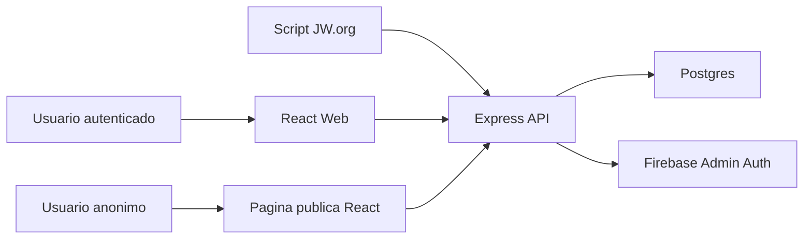

# Arquitetura Tecnica

Relacionado: [[01 - Visao Geral do Sistema]], [[04 - Modelo de Dados]], [[05 - API e Contratos]], [[07 - Seguranca e Permissoes]]

## Visao geral

O Varjotapp sera separado em frontend React e backend Express.

## Frontend

- React com TypeScript.
- shadcn como base de componentes.
- Estilos customizados.
- Tudo componentizado para reuso.
- UI em Portugues.
- Tabelas distintas para reuniao de meio de semana e fim de semana.
- PDF gerado no frontend a partir da tabela renderizada.

## Backend

- Node.js com TypeScript.
- Express.
- Prisma.
- Postgres.
- Firebase Admin SDK para validar token de login.
- Regras de autorizacao no backend com base na tabela `User`.
- Importacao do JSON atual do script com normalizacao interna.

## Multi-congregacao

- O banco e o backend devem ser modelados com `Congregation`.
- A primeira versao opera como single-congregation na pratica.
- A congregacao inicial pode ser criada por seed/admin.
- Cada usuario pertence a uma congregacao.
- UI para criar/trocar congregacao fica fora do primeiro release.

## Timezone e datas

- Datas devem ser persistidas em UTC.
- Exibicao e calculos de agrupamento devem usar `CongregationSettings.timezone`.
- O agrupamento por mes usa `MeetingWeek.startAt`.
- A UI exibe o intervalo `startAt` ate `endAt`.

## Estrutura de reuniao

- A estrutura operacional sera relacional.
- O payload original importado pode ser salvo como `rawSourcePayload` para debug/auditoria.
- A aplicacao deve trabalhar em cima de `MeetingSection`, `MeetingPart`, `MeetingPartSlot` e `Assignment`.

## Concorrencia

- O primeiro release nao tera controle de concorrencia.
- Se dois usuarios editarem a mesma reuniao ao mesmo tempo, o ultimo save pode sobrescrever alteracoes anteriores.
- O backend ainda deve salvar em transacao e registrar historico do payload recebido.

## Regras de transacao

Operacoes que devem ser transacionais:

- Criar/importar semana e criar as duas reunioes.
- Salvar edicao em lote de uma tabela.
- Regenerar tokens/chaves.
- Soft delete/restauracao de participante quando houver impactos relacionados.

