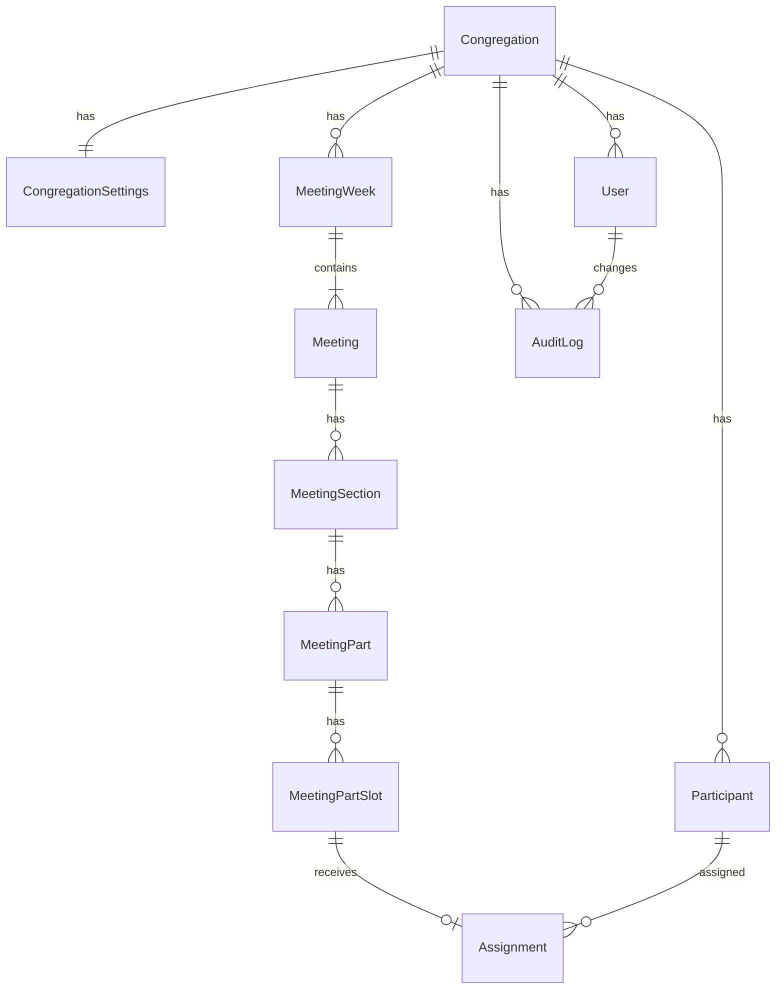

# Modelo de Dados

Relacionado: [[03 - Arquitetura Tecnica]], [[05 - API e Contratos]], [[02 - Decisoes de Produto]]

## Entidades principais

### Congregation

Representa um nucleo isolado.

Campos sugeridos:

- `id`
- `name`
- `createdAt`
- `updatedAt`

Relacionamentos:

- `settings`
- `users`
- `participants`
- `meetingWeeks`

### CongregationSettings

Campos do primeiro release:

- `id`
- `congregationId`
- `timezone`
- `midweekDefaultWeekday`
- `weekendDefaultWeekday`
- `anonymousReadTokenHash`
- `anonymousReadTokenCreatedAt`
- `scriptApiKeyHash`
- `scriptApiKeyCreatedAt`
- `createdAt`
- `updatedAt`

Observacao: os valores puros do token anonimo e da API key tecnica so aparecem no momento da geracao/regeneracao.

### User

Usuario do sistema, separado de participante.

Campos sugeridos:

- `id`
- `congregationId`
- `email`
- `name`
- `role`: string, valores iniciais `admin` ou `editor`
- `active`
- `createdAt`
- `updatedAt`

Regra:

- Firebase autentica.
- Backend autoriza somente se o e-mail existir como usuario ativo no banco.

### Participant

Pessoa que pode receber designacoes.

Campos sugeridos:

- `id`
- `congregationId`
- `name`
- `gender`
- `phone`
- `whatsapp`
- `deletedAt`
- `createdAt`
- `updatedAt`

Regras:

- `phone` e `whatsapp` sao strings opcionais/livres.
- `deletedAt = null` significa participante disponivel.
- Soft delete preenche `deletedAt`.
- Restauracao define `deletedAt = null`.
- Participantes deletados nao aparecem em novas selecoes.

### MeetingWeek

Agrega a semana e suas duas reunioes.

Campos sugeridos:

- `id`
- `congregationId`
- `ref`
- `year`
- `month`
- `yearWeek`
- `startAt`
- `endAt`
- `bibleReading`
- `rawSourcePayload`
- `createdAt`
- `updatedAt`

Regras:

- Uma `MeetingWeek` deve ter exatamente duas `Meeting`: `midweek` e `weekend`.
- O agrupamento mensal usa `startAt`.

### Meeting

Representa uma reuniao dentro de uma semana.

Campos sugeridos:

- `id`
- `meetingWeekId`
- `type`: string, valores iniciais `midweek` ou `weekend`
- `meetingDate`
- `publicTalkTheme`
- `publicSpeakerName`
- `publicSpeakerCongregation`
- `createdAt`
- `updatedAt`

Observacoes:

- Nao usar enum no banco para tipo de reuniao; usar string.
- Campos livres do fim de semana ficam na propria `Meeting`.
- Campos livres devem entrar no historico quando alterados.

### MeetingSection

Agrupa partes dentro de uma reuniao.

Campos sugeridos:

- `id`
- `meetingId`
- `sectionKey`
- `title`
- `order`
- `createdAt`
- `updatedAt`

Exemplos:

- `treasures`
- `ministery`
- `christianLife`
- `weekendOpening`
- `publicTalk`
- `watchtower`

### MeetingPart

Parte designavel dentro de uma secao.

Campos sugeridos:

- `id`
- `meetingSectionId`
- `partKey`
- `title`
- `order`
- `assignable`
- `createdAt`
- `updatedAt`

Regra:

- `partKey` deve ser estavel.
- Titulo nao e identidade.

### MeetingPartSlot

Slot de uma parte que pode receber participante.

Campos sugeridos:

- `id`
- `meetingPartId`
- `position`
- `label`
- `createdAt`
- `updatedAt`

Regras:

- `position` e numerico e estavel.
- `label` e configuravel e usado na tabela.

### Assignment

Vincula participante a um slot.

Campos sugeridos:

- `id`
- `meetingPartSlotId`
- `participantId`
- `createdAt`
- `updatedAt`

Regra:

- Cada slot deve ter no maximo uma designacao ativa.
- Uma parte pode ter ate dois slots no primeiro release.

### AuditLog

Historico objetivo de alteracoes.

Campos sugeridos:

- `id`
- `congregationId`
- `changedByUserId`
- `changedAt`
- `entityType`
- `entityId`
- `field`
- `previousValue`
- `newValue`

Registra:

- Mudancas de designacoes.
- Mudancas em campos livres do fim de semana.

## Relacionamento resumido

